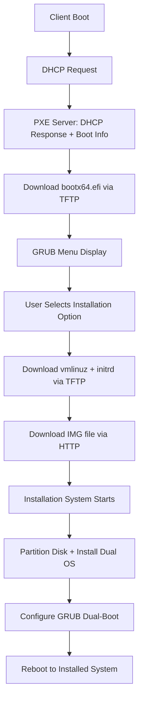

# PXE Boot System Strategy & Implementation

## Overview

This system provides a complete PXE (Preboot Execution Environment) solution for automated dual-OS installation on target machines. The strategy separates concerns between PXE server infrastructure and installation image creation for better maintainability and scalability.

## Updated Architecture (2025)

### Separation of Concerns

This repository now focuses solely on **installation image creation** and integrates with a dedicated PXE server infrastructure.

#### PXE Server Infrastructure ([cicorias/pxe-server-setup](https://github.com/cicorias/pxe-server-setup))
- **DHCP Server**: Assigns IP addresses and PXE boot options
- **TFTP Server**: Serves initial boot files (GRUB, kernel, initrd)
- **HTTP Server**: Serves large files (IMG files, installation media)
- **NFS Server**: Provides network filesystem access (legacy compatibility)
- **Service Management**: Automated setup, monitoring, and maintenance

#### Installation Image Creation (This Repository)
- **Build System**: Creates custom installation environments
- **IMG Generation**: Modern HTTP-based image serving
- **SquashFS Creation**: Legacy live boot compatibility
- **Integration Tools**: Deployment and configuration scripts
- **Dual-OS Support**: Specialized dual-boot installation logic

### System Architecture

### Network Boot Flow



### Build System (Development/Build Machine)
- Runs `create-pxe-system.sh` to build all components
- Creates IMG files for HTTP serving (modern approach)
- Creates SquashFS files for live boot (legacy compatibility)
- Generates integration configuration for PXE server deployment
- Builds OS images and boot files

### PXE Server (Network Boot Server)
- DHCP Server: Assigns IP addresses and PXE boot options
- TFTP Server: Serves initial boot files (GRUB, kernel, initrd)
- HTTP Server: Serves large files (IMG files, installation media)
- NFS Server: Legacy support for SquashFS live boot

### Target Machine (Installation Target)
- Boots from network (PXE)
- Downloads and runs custom installation environment
- Partitions disk and installs dual-boot system
- Configures GRUB for dual-OS selection

## Partition Layout Strategy

The target machine will have this partition layout:

```
/dev/sda1 - GRUB Partition (512MB, FAT32)
  ├── GRUB bootloader (UEFI + BIOS)
  ├── Boot configuration
  └── System utilities

/dev/sda2 - OS1 Root (Ubuntu, 3.5GB, ext4)
  ├── Complete Ubuntu system
  └── Mounted at / when booting Ubuntu

/dev/sda3 - OS2 Root (Debian, 3.5GB, ext4)  
  ├── Complete Debian system
  └── Mounted at / when booting Debian

/dev/sda4 - Data Partition (Remaining space, ext4)
  ├── Shared data between both OS
  ├── User home directories
  ├── Logs and backups
  └── Mounted at /data in both OS
```

## Key Differences from Original Scripts

### From `01-build-rootfs-on-build-box.sh` (Archived):
- ✅ **Kept**: SquashFS live system approach (optional)
- ✅ **Kept**: Debian-based installer environment
- ✅ **Enhanced**: Added IMG file generation for HTTP serving
- ✅ **Enhanced**: Added dual-boot capability
- 🔄 **Updated**: Separated PXE server setup to dedicated repository

### From `make-image.sh` (Archived):
- ✅ **Kept**: Dual-OS concept (Ubuntu + Debian)
- ✅ **Kept**: Partition management strategy
- ✅ **Enhanced**: Network-based installation instead of local image
- ✅ **Enhanced**: Separate GRUB partition for better management
- 🔄 **Updated**: Integrated with modern PXE server infrastructure

## File Outputs & Usage

### Build Phase (`create-pxe-system.sh`)

**Artifacts Created:**
```
artifacts/
├── images/                       # Modern IMG files for HTTP serving
│   ├── dual-os-installer.img     # Complete dual-OS installation system
│   ├── ubuntu-minimal.img        # Ubuntu filesystem image
│   └── debian-minimal.img        # Debian filesystem image
├── pxe-files/                    # Legacy PXE boot files
│   ├── vmlinuz                   # Linux kernel
│   ├── initrd                    # Initial ramdisk
│   └── filesystem.squashfs       # Live system (legacy compatibility)
├── os-images/                    # OS filesystem archives
│   ├── ubuntu-os.tar.gz          # Ubuntu filesystem
│   └── debian-os.tar.gz          # Debian filesystem
└── pxe-integration/              # Integration configuration
    ├── grub-entries.cfg          # GRUB menu entries
    ├── deployment-instructions.md # Manual deployment guide
    ├── copy-commands.sh          # Automated setup script
    └── manifest.txt              # File inventory
```

### Deployment Phase (On PXE Server)

**Modern Approach (Recommended):**
1. Set up PXE server using [cicorias/pxe-server-setup](https://github.com/cicorias/pxe-server-setup)
2. Deploy artifacts using `./scripts/deploy-to-pxe-server.sh`
3. IMG files served via HTTP for fast, reliable boot

**Legacy Approach (Backward Compatibility):**
1. SquashFS files served via HTTP/NFS
2. Live boot environment with traditional PXE

**Server Configuration Files:**

1. **DHCP Configuration** (`/etc/dhcp/dhcpd.conf`):
```bash
subnet 10.1.1.0 netmask 255.255.255.0 {
    range 10.1.1.100 10.1.1.200;
    option routers 10.1.1.1;
    next-server 10.1.1.1;        # TFTP server
    filename "bootx64.efi";       # UEFI boot file
}
```

2. **TFTP Configuration** (`/etc/default/tftpd-hpa`):
```bash
```
TFTP_USERNAME="tftp"
TFTP_DIRECTORY="/var/lib/tftpboot"
TFTP_ADDRESS="10.1.1.1:69"
TFTP_OPTIONS="--secure"
```

3. **HTTP Configuration** (`/etc/nginx/sites-available/pxe`):
```nginx
server {
    listen 80;
    root /var/www/html/pxe;
    
    # Serve IMG files
    location /images/ {
        autoindex on;
        sendfile on;
        tcp_nopush on;
    }
    
    # Legacy PXE files
    location /pxe-files/ {
        autoindex on;
    }
}
```

4. **GRUB Configuration** (`/var/lib/tftpboot/grub/grub.cfg`):
```bash
menuentry 'Dual-OS Installation System' {
    echo 'Loading Dual-OS Installation System...'
    linux /kernels/device-setup/vmlinuz boot=live fetch=http://10.1.1.1/images/dual-os-installer.img ip=dhcp
    initrd /initrd/device-setup/initrd
    boot
}
```

## Usage Workflows

### Quick Setup Workflow

1. **Set up PXE Server:**
   ```bash
   # On PXE server
   git clone https://github.com/cicorias/pxe-server-setup.git
   cd pxe-server-setup
   sudo ./install.sh --uefi --local-dhcp
   ```

2. **Build Installation Images:**
   ```bash
   # On build machine
   git clone https://github.com/cicorias/device-setup-initialization.git
   cd device-setup-initialization
   ./scripts/create-pxe-system.sh
   ```

3. **Deploy to PXE Server:**
   ```bash
   ./scripts/deploy-to-pxe-server.sh 10.1.1.1
   ```

4. **Boot Client:**
   - Configure client for PXE boot
   - Select installation option from GRUB menu
   - Follow installation prompts

### Advanced Workflows

#### Custom Image Creation

```bash
# Create custom-sized images
./scripts/create-pxe-system.sh --img-size 8G

# Create only IMG files (no SquashFS)
./scripts/create-pxe-system.sh --no-squashfs

# Legacy compatibility only
./scripts/create-pxe-system.sh --no-img
```

#### Multi-Server Deployment

```bash
# Deploy to multiple PXE servers
for server in 10.1.1.1 10.2.1.1 10.3.1.1; do
    ./scripts/deploy-to-pxe-server.sh "$server"
done
```

#### Manual Integration

```bash
# Generate integration configuration
./scripts/generate-pxe-config.sh

# Follow manual deployment instructions
cat artifacts/pxe-integration/deployment-instructions.md
```

## Network Boot Process

### UEFI PXE Boot Sequence

1. **Initial Boot**
   - Client broadcasts DHCP request
   - DHCP server responds with IP and boot filename (`bootx64.efi`)

2. **Bootloader Download**
   - Client downloads `bootx64.efi` via TFTP
   - GRUB EFI bootloader initializes

3. **Menu Display**
   - GRUB displays installation options
   - User selects desired installation

4. **Kernel Boot**
   - GRUB downloads `vmlinuz` and `initrd` via TFTP
   - Linux kernel starts with boot parameters

5. **Image Download**
   - Installation system downloads IMG file via HTTP
   - IMG file mounted as installation source

6. **Installation Process**
   - Disk partitioned according to dual-OS layout
   - Operating systems installed from IMG files
   - GRUB configured for dual-boot

### Boot Parameters

Key boot parameters used:

- `boot=live` - Enable live boot system
- `fetch=http://server/path/image.img` - Download IMG file via HTTP
- `ip=dhcp` - Configure network via DHCP
- `console=tty0` - Console output configuration

## Legacy vs Modern Approach

### Legacy Approach (SquashFS + NFS)

**Advantages:**
- Proven compatibility with older systems
- Live boot environment for troubleshooting
- Lower bandwidth requirements (compressed SquashFS)

**Disadvantages:**
- Complex NFS setup requirements
- Slower boot times
- More complex debugging

**Usage:**
```bash
# Create SquashFS-based system
./scripts/create-pxe-system.sh --no-img

# Boot with SquashFS
linux vmlinuz boot=live fetch=http://server/pxe-files/filesystem.squashfs
```

### Modern Approach (IMG + HTTP)

**Advantages:**
- Simpler HTTP-only serving
- Faster downloads with HTTP/2
- Better caching and CDN support
- More reliable than NFS

**Disadvantages:**
- Larger bandwidth requirements
- Less tested with older hardware

**Usage:**
```bash
# Create IMG-based system
./scripts/create-pxe-system.sh --no-squashfs

# Boot with IMG file
linux vmlinuz boot=live fetch=http://server/images/dual-os-installer.img
```

## Migration Strategy

### From Legacy Monolithic Setup

1. **Assessment Phase**
   - Document current PXE server configuration
   - Identify customizations and requirements
   - Plan migration testing approach

2. **PXE Server Migration**
   - Set up new PXE server using pxe-server-setup
   - Migrate network configuration
   - Test basic PXE functionality

3. **Image Migration**
   - Build new images using device-setup-initialization
   - Test with existing hardware
   - Validate installation process

4. **Deployment**
   - Deploy to staging environment
   - Perform thorough testing
   - Migrate production systems

### Rollback Plan

If migration issues occur:

1. **Preserve Legacy System**
   - Keep original PXE server configuration
   - Maintain legacy scripts in archive
   - Document rollback procedures

2. **Rollback Process**
   ```bash
   # Use legacy deployment package if needed
   CREATE_LEGACY_PACKAGE=true ./scripts/create-pxe-system.sh
   
   # Use archived scripts
   ./scripts/archive/create-legacy-deployment.sh
   ```

## Troubleshooting Guide

### Build Issues

**Problem**: SquashFS creation fails
```bash
# Check available space
df -h

# Check permissions
sudo chown -R $(whoami) artifacts/

# Rebuild with verbose output
./scripts/create-pxe-system.sh --help
```

**Problem**: IMG file creation fails
```bash
# Check loop device availability
sudo losetup -f

# Check for bc calculator
sudo apt-get install bc

# Increase IMG size
./scripts/create-pxe-system.sh --img-size 8G
```

### Deployment Issues

**Problem**: SSH connection fails
```bash
# Test connectivity
ssh -v root@10.1.1.1

# Check SSH keys
ssh-copy-id root@10.1.1.1
```

**Problem**: PXE server not found
```bash
# Verify PXE server setup
ssh root@10.1.1.1 'ls -la /home/cicorias/g/pxe-server-setup'

# Check service status
ssh root@10.1.1.1 'sudo systemctl status tftpd-hpa nginx'
```

### Boot Issues

**Problem**: Client doesn't get DHCP response
```bash
# Check DHCP server logs
ssh root@10.1.1.1 'sudo journalctl -u isc-dhcp-server -f'

# Verify network configuration
ssh root@10.1.1.1 'sudo systemctl status isc-dhcp-server'
```

**Problem**: TFTP download fails
```bash
# Test TFTP manually
tftp 10.1.1.1 -c get bootx64.efi

# Check TFTP logs
ssh root@10.1.1.1 'sudo journalctl -u tftpd-hpa -f'
```

**Problem**: HTTP download fails
```bash
# Test HTTP access
curl -I http://10.1.1.1/images/dual-os-installer.img

# Check nginx logs
ssh root@10.1.1.1 'sudo tail -f /var/log/nginx/access.log'
```

## Performance Optimization

### Build Performance

- Use SSD storage for build artifacts
- Increase available RAM for chroot operations
- Parallel image creation (future enhancement)

### Network Performance

- Use gigabit ethernet for PXE server
- Optimize HTTP server for large file transfers
- Consider nginx caching for repeated deployments

### Boot Performance

- Minimize IMG file sizes
- Use compressed filesystems where appropriate
- Optimize kernel and initrd for target hardware

## Security Considerations

### Build Security

- Verify base system packages
- Scan built images for vulnerabilities
- Use secure package repositories

### Network Security

- Isolate PXE network segment
- Use VLANs for client isolation
- Monitor PXE server access logs

### Access Control

- Restrict SSH access to PXE server
- Use key-based authentication
- Implement firewall rules

## Future Enhancements

### Planned Features

- **Container-based builds**: Use Docker/Podman for reproducible builds
- **Multiple architecture support**: ARM64 and other architectures
- **Cloud integration**: Support for cloud-based PXE servers
- **Enhanced monitoring**: Better logging and metrics

### Community Contributions

- **Testing**: More hardware compatibility testing
- **Documentation**: Additional use case examples
- **Integration**: Support for other PXE server implementations
- **Automation**: CI/CD integration for automated builds

This strategy document provides a comprehensive approach to PXE-based dual-OS installation with clear separation of concerns, modern deployment methods, and migration paths from legacy systems.
```

3. **HTTP Configuration** (nginx):
```bash
server {
    listen 80;
    root /var/www/html;
    location /pxe-files/ { autoindex on; }
    location /images/ { autoindex on; }
}
```

## Network Services Required

### DHCP Server
- **Purpose**: Assign IP addresses and PXE boot options
- **Port**: 67/68 (UDP)
- **Configuration**: Points clients to TFTP server

### TFTP Server  
- **Purpose**: Serve initial boot files (small, fast)
- **Port**: 69 (UDP)
- **Files Served**:
  - `pxelinux.0` - PXELINUX bootloader (standard PXE)
  - `vmlinuz` - Linux kernel (~8MB)
  - `initrd` - Initial ramdisk (~50MB)
  - `*.c32` - Syslinux modules

### HTTP Server
- **Purpose**: Serve large files (efficient for big downloads)
- **Port**: 80 (TCP)
- **Files Served**:
  - `filesystem.squashfs` - Live system (~200MB)
  - `ubuntu-os.tar.gz` - Ubuntu OS (~800MB)
  - `debian-os.tar.gz` - Debian OS (~600MB)

## Installation Process Flow

1. **PXE Boot**: Target machine requests IP via DHCP
2. **DHCP Response**: Server provides IP + TFTP server info
3. **TFTP Download**: Client downloads `pxelinux.0`, `vmlinuz`, `initrd`
4. **HTTP Download**: Client downloads `filesystem.squashfs` via HTTP
5. **Live Boot**: Machine boots into Debian installer environment
6. **Disk Setup**: Installer partitions target disk (4 partitions)
7. **OS Download**: Installer downloads OS images via HTTP
8. **Installation**: OS images extracted to partitions
9. **GRUB Setup**: Bootloader installed with dual-boot menu
10. **Reboot**: Machine reboots into installed dual-OS system

## Usage Instructions

### 1. Build Phase (Development Machine)
```bash
# Create the PXE system
cd /path/to/project
chmod +x scripts/create-pxe-system.sh
sudo ./scripts/create-pxe-system.sh

# Test the deployment package
./scripts/test-deployment-package.sh
```

### 2. Deployment Phase (PXE Server)
```bash
# Copy deployment package to server
scp -r artifacts/server-deployment/ user@pxe-server:/tmp/

# On PXE server, configure network settings
ssh user@pxe-server
cd /tmp/server-deployment
nano config/server-config.env

# Deploy all services
sudo ./deploy-pxe-server.sh
```

### 3. Target Machine Installation
```bash
# Set machine to PXE boot (BIOS/UEFI setting)
# Boot machine - it will:
# 1. Get IP from DHCP
# 2. Download boot files via TFTP
# 3. Download installer via HTTP
# 4. Boot into installer environment
# 5. Run automatic installation (or manual if interactive)
```

## Customization Options

### Modify OS Images
- Edit the `build_os_images()` function in `create-pxe-system.sh`
- Add/remove packages during debootstrap
- Configure users, services, etc.

### Change Partition Layout
- Edit the `create_partitions()` function in disk installer
- Adjust partition sizes and filesystem types
- Modify mount points in `/etc/fstab`

### Network Configuration
- Edit `config/server-config.env` before deployment
- Adjust IP ranges, server addresses, etc.
- Modify DHCP options for specific requirements

### Auto vs Manual Installation
- Installer supports both interactive and automatic modes
- Enable auto-install by uncommenting line in installer script
- Use DHCP vendor classes for conditional auto-install

## Security Considerations

1. **Network Security**: Use isolated network for PXE operations
2. **File Integrity**: Consider checksums for downloaded images
3. **Access Control**: Restrict TFTP/HTTP access if needed
4. **Default Passwords**: Change default passwords in OS images

## Troubleshooting

### Common Issues:
1. **DHCP conflicts**: Ensure only one DHCP server on network
2. **Firewall blocking**: Open ports 67/68 (DHCP), 69 (TFTP), 80 (HTTP)
3. **Large file timeouts**: Increase nginx timeouts for slow networks
4. **Boot failures**: Check PXE boot order in BIOS/UEFI
5. **Kernel panics**: Verify initrd and kernel compatibility

### Verification Commands:
```bash
# Test TFTP
tftp pxe-server-ip -c get pxelinux.0

# Test HTTP
curl -I http://pxe-server-ip/pxe-files/filesystem.squashfs

# Check services
systemctl status isc-dhcp-server tftpd-hpa nginx

# Monitor logs
tail -f /var/log/syslog
tail -f /var/log/nginx/access.log
```

This strategy provides a complete, automated solution for deploying dual-boot systems via PXE while maintaining flexibility for customization and manual intervention when needed.
