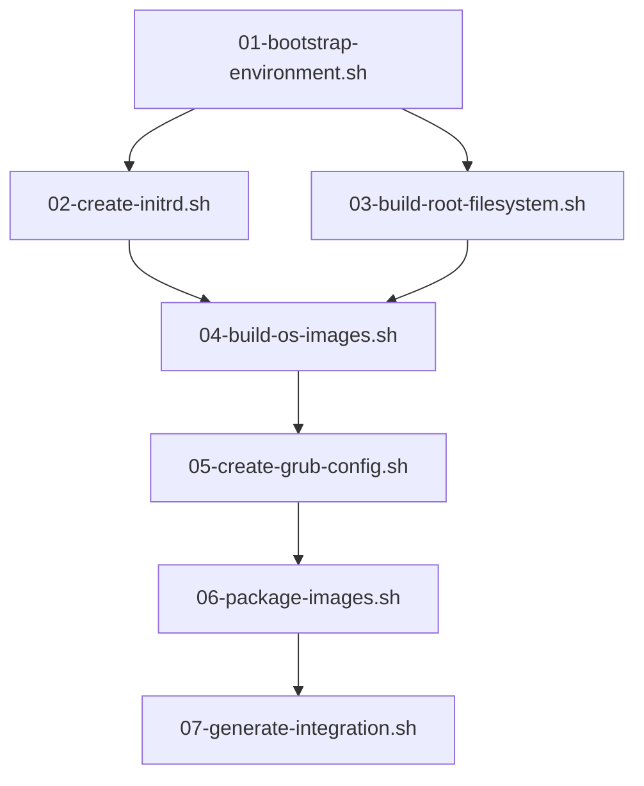

# Build System Architecture

## Overview

The device initialization build system creates PXE-bootable images using a modular, numbered script approach. This document details the build architecture, script organization, and artifact generation.

## Build Philosophy

### Design Principles

1. **Numbered Scripts**: Sequential execution with clear dependencies
2. **Modular Components**: Each script handles a specific build phase
3. **Idempotent Operations**: Scripts can be re-run safely
4. **Artifact Organization**: Clear output structure for deployment
5. **UEFI-First**: Focus on modern UEFI boot systems

### Build Environment Requirements

- **Operating System**: Ubuntu 22.04 LTS or Debian 12
- **Architecture**: x86_64 (AMD64)
- **Memory**: Minimum 4GB RAM (8GB recommended)
- **Storage**: Minimum 20GB free space for artifacts
- **Network**: Internet access for package downloads
- **Privileges**: sudo access for chroot and loop device operations

## Script Architecture

### Build Script Sequence

```
build-device-images.sh                 # Main build orchestrator
├── scripts/01-bootstrap-environment.sh    # Create build environment
├── scripts/02-create-initrd.sh           # Build custom initrd
├── scripts/03-build-root-filesystem.sh   # Create root partition
├── scripts/04-build-os-images.sh         # Build OS1/OS2 images
├── scripts/05-create-grub-config.sh      # Generate GRUB2 config
├── scripts/06-package-images.sh          # Package IMG files
└── scripts/07-generate-integration.sh    # Create PXE integration
```

### Script Dependencies



## Build Phases

### Phase 1: Bootstrap Environment (01-bootstrap-environment.sh)

**Purpose**: Set up the build environment and install required tools

**Operations**:
- Install build dependencies (debootstrap, squashfs-tools, etc.)
- Create directory structure
- Set up build configuration
- Validate system requirements

**Dependencies**: None

**Artifacts**:
```
artifacts/
├── build-env/
│   ├── config.env              # Build configuration
│   └── requirements.txt        # Installed packages
└── logs/
    └── 01-bootstrap.log        # Build log
```

### Phase 2: Create InitRD (02-create-initrd.sh)

**Purpose**: Build custom initial ramdisk with device initialization tools

**Operations**:
- Create minimal initramfs
- Include network drivers and tools
- Add device initialization scripts
- Package initrd for PXE boot

**Dependencies**: 01-bootstrap-environment.sh

**Artifacts**:
```
artifacts/
├── pxe-files/
│   ├── initrd                  # Custom initial ramdisk
│   └── initrd.manifest         # Package list
└── build-env/
    └── initrd-build/           # Build directory
```

### Phase 3: Build Root Filesystem (03-build-root-filesystem.sh)

**Purpose**: Create the root partition filesystem with configuration tools

**Operations**:
- Bootstrap Ubuntu 24.04.3 base system
- Install configuration scripts
- Add GRUB2 configuration tools
- Create filesystem image

**Dependencies**: 01-bootstrap-environment.sh

**Artifacts**:
```
artifacts/
├── images/
│   └── root-filesystem.img     # Root partition image (2GB)
└── build-env/
    └── root-build/             # Build chroot
```

### Phase 4: Build OS Images (04-build-os-images.sh)

**Purpose**: Create OS1 and OS2 filesystem images

**Operations**:
- Bootstrap Ubuntu 24.04.3 for OS1 and OS2
- Install minimal system packages
- Configure system services
- Create filesystem images

**Dependencies**: 01-bootstrap-environment.sh, 02-create-initrd.sh

**Artifacts**:
```
artifacts/
├── images/
│   ├── os1-ubuntu-minimal.img  # OS1 filesystem (3.7GB)
│   └── os2-ubuntu-minimal.img  # OS2 filesystem (3.7GB)
├── os-images/
│   ├── os1-ubuntu.tar.gz       # OS1 archive
│   └── os2-ubuntu.tar.gz       # OS2 archive
└── build-env/
    ├── os1-build/              # OS1 build chroot
    └── os2-build/              # OS2 build chroot
```

### Phase 5: Create GRUB Configuration (05-create-grub-config.sh)

**Purpose**: Generate GRUB2 configuration files for initialization and local boot

**Operations**:
- Create PXE boot GRUB configuration
- Generate local boot GRUB configuration
- Create menu entry templates
- Package GRUB modules

**Dependencies**: 01-bootstrap-environment.sh through 04-build-os-images.sh

**Artifacts**:
```
artifacts/
├── grub-config/
│   ├── pxe-grub.cfg           # PXE boot configuration
│   ├── local-grub.cfg         # Local boot configuration
│   └── 40_custom              # Custom menu entries
└── pxe-files/
    ├── grub/                  # GRUB modules
    └── vmlinuz                # Kernel for PXE boot
```

### Phase 6: Package Images (06-package-images.sh)

**Purpose**: Create final IMG files and prepare for HTTP serving

**Operations**:
- Combine root filesystem with configuration
- Create device initialization environment IMG
- Optimize IMG files for network serving
- Generate checksums

**Dependencies**: All previous phases

**Artifacts**:
```
artifacts/
├── images/
│   ├── device-init-environment.img  # Complete init system
│   ├── os1-ubuntu-minimal.img       # OS1 filesystem
│   ├── os2-ubuntu-minimal.img       # OS2 filesystem
│   └── checksums.txt               # SHA256 checksums
└── packaging/
    └── image-manifest.json         # Image metadata
```

### Phase 7: Generate Integration (07-generate-integration.sh)

**Purpose**: Create PXE server integration files and deployment scripts

**Operations**:
- Generate GRUB menu entries for PXE server
- Create deployment instructions
- Package deployment scripts
- Create manifest files

**Dependencies**: All previous phases

**Artifacts**:
```
artifacts/
└── pxe-integration/
    ├── grub-entries.cfg          # GRUB menu entries
    ├── deployment-instructions.md # Manual deployment guide
    ├── deploy-to-pxe-server.sh   # Automated deployment
    └── manifest.txt              # Complete file inventory
```

## Configuration Management

### Build Configuration

The build system uses environment variables and configuration files:

```bash
# artifacts/build-env/config.env
UBUNTU_RELEASE="noble"           # Ubuntu 24.04.3 LTS
UBUNTU_MIRROR="http://archive.ubuntu.com/ubuntu"
TARGET_ARCH="amd64"

# Partition sizes
EFI_SIZE="200M"
ROOT_SIZE="2G"
SWAP_SIZE="4G"
OS1_SIZE="3.7G"
OS2_SIZE="3.7G"

# Network configuration
PXE_SERVER_IP="10.1.1.1"
DHCP_RANGE_START="10.1.1.100"
DHCP_RANGE_END="10.1.1.200"

# Build options
ENABLE_DEBUG="false"
PARALLEL_BUILDS="true"
COMPRESSION_LEVEL="6"
```

### Custom Build Options

```bash
# Build with custom sizes
./build-device-images.sh \
    --os1-size 5G \
    --os2-size 5G \
    --root-size 3G \
    --compression-level 9

# Build for specific network
./build-device-images.sh \
    --pxe-server 192.168.1.10 \
    --network-config static

# Debug build
./build-device-images.sh --debug --verbose
```

## Package Management

### Base System Packages

#### Root Filesystem Packages
```bash
# Essential system packages
systemd systemd-sysv
network-manager
openssh-server
curl wget
dialog whiptail
bash-completion

# Partitioning and filesystem tools
parted gdisk
dosfstools e2fsprogs
rsync pv

# GRUB bootloader
grub-pc grub-efi-amd64
grub-common
```

#### OS1/OS2 Packages
```bash
# Minimal Ubuntu installation
ubuntu-minimal
linux-image-generic
systemd systemd-sysv
network-manager
openssh-server

# Container runtime (optional)
docker.io
containerd

# Monitoring tools
htop iotop
systemd-journal-remote
```

### Package Selection Strategy

1. **Minimal Base**: Start with minimal Ubuntu installation
2. **Add Essential Tools**: Include only necessary packages
3. **Avoid Desktop**: No GUI packages or unnecessary services
4. **Security Focus**: Include security updates and tools
5. **Container Ready**: Optional container runtime support

## Image Optimization

### Size Optimization

```bash
# Clean package cache
apt-get clean
rm -rf /var/lib/apt/lists/*

# Remove unnecessary files
rm -rf /tmp/* /var/tmp/*
rm -rf /usr/share/doc/* /usr/share/man/*

# Zero free space for better compression
dd if=/dev/zero of=/zeros bs=1M || true
rm -f /zeros
```

### Compression Strategies

- **SquashFS**: High compression for read-only filesystems
- **IMG Files**: Raw filesystems for flexibility
- **Gzip**: Additional compression optimized for PXE network transfer

### Network Optimization

- **Chunked Transfer**: Support for HTTP/2 and chunked encoding
- **Caching Headers**: Proper HTTP caching for repeated downloads
- **Parallel Downloads**: Support for concurrent image downloads

## Testing and Validation

### Build Testing

```bash
# Test individual build phases
./scripts/01-bootstrap-environment.sh --test
./scripts/02-create-initrd.sh --validate

# Full build test
./build-device-images.sh --test-build

# Image validation
./validate-images.sh artifacts/images/
```

### Integration Testing

```bash
# Test PXE server integration
./test-pxe-integration.sh --server 10.1.1.1

# Test device boot process
./test-device-boot.sh --image device-init-environment.img

# Validate GRUB configuration
grub-script-check artifacts/grub-config/pxe-grub.cfg
```

## Troubleshooting

### Common Build Issues

1. **Insufficient Disk Space**
   ```bash
   df -h artifacts/
   # Clean previous builds
   ./clean-artifacts.sh
   ```

2. **Network Timeouts**
   ```bash
   # Use local mirror
   export UBUNTU_MIRROR="http://local-mirror/ubuntu"
   ```

3. **Permission Issues**
   ```bash
   # Check sudo access
   sudo -v
   # Fix artifacts permissions
   sudo chown -R $(whoami) artifacts/
   ```

4. **Chroot Failures**
   ```bash
   # Clean up mounts
   ./cleanup-mounts.sh
   # Check for stale processes
   ps aux | grep chroot
   ```

### Debug Mode

```bash
# Enable debug output
export DEBUG=true
export VERBOSE=true

# Run with debugging
./build-device-images.sh --debug 2>&1 | tee build-debug.log
```

### Log Analysis

```bash
# Check build logs
tail -f artifacts/logs/build.log

# Analyze errors
grep -i error artifacts/logs/*.log

# Check specific phase
cat artifacts/logs/04-build-os-images.log
```

## Performance Considerations

### Build Performance

- **Parallel Execution**: Use multiple CPU cores where possible
- **SSD Storage**: Use SSD for build artifacts
- **Memory**: Allocate sufficient RAM for chroot operations
- **Network**: Fast internet connection for package downloads

### Optimization Tips

```bash
# Use local package cache
export APT_PROXY="http://apt-cache:3142"

# Enable parallel builds
export MAKEFLAGS="-j$(nproc)"

# Use tmpfs for temporary files
mount -t tmpfs -o size=4G tmpfs /tmp/build-temp
```

This build architecture provides a robust, maintainable system for creating device initialization images while supporting customization and optimization for different deployment scenarios.
